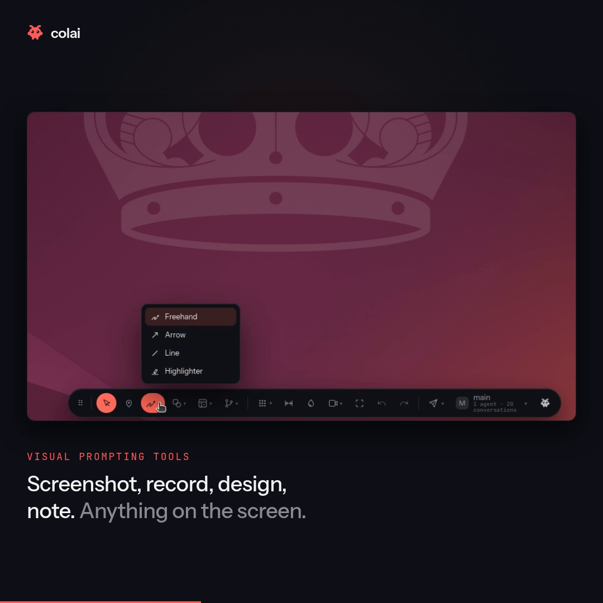

# colai toolbar

Point at anything on your screen and hand it to Claude Code.

[](https://github.com/Shahar-Nadiv/colai-clawhub/actions/workflows/ci.yml)
[](https://github.com/Shahar-Nadiv/colai-clawhub/releases)
[](LICENSE)
-555)



[**Watch it in 30 seconds**](media/toolbar.mp4)

A small rail that floats over every application on your desktop. Draw a box round a thing,
point at a thing, measure it, pick a colour off it, record a few seconds of it — then say
what you want in a sentence and send it to Claude Code, along with a picture of exactly
what you meant.

It belongs to no application. There is no plugin to install in your editor, no browser
extension, no SDK. If it is on the screen, you can point at it — a canvas game, a PCB in a
3D viewer, a native desktop app, a PDF, a video call.

> **Windows (x86-64) and Linux/X11 today. macOS (Apple Silicon) is in preview:** it is built,
> signed and tested in CI on a real Mac and installs like the others, but nobody has walked
> its checklist by hand yet — see [docs/macos.md](docs/macos.md).
> See [Requirements](#requirements) before installing. On Linux it refuses to start on Wayland
> rather than working badly, and it tells you how to switch.

## Install

```bash
claude plugin marketplace add Shahar-Nadiv/colai-clawhub
claude plugin install colai@colai
```

The same two lines work on Windows, Linux and macOS. On Windows they run inside Git for
Windows, which Claude Code already requires, so nothing extra is needed to install.

That is the whole setup. **The toolbar then starts itself** the next time you open a
Claude Code session — there is no command to run. It is a desktop overlay, not a subprocess
of that conversation, so closing the session leaves it on screen.
<kbd>Ctrl</kbd>+<kbd>Alt</kbd>+<kbd>Space</kbd> shows it and hides it again, from anywhere,
including while you are typing in Claude Code; set `COLAI_HOTKEY` to change the shortcut, and
double-click the grip to put it away. Set `COLAI_AUTOSTART=0` if you would rather it not
start on its own (then run `colai-toolbar show` yourself to bring it up).

It opens pointed at the conversation it started in, so the first thing you mark already has
somewhere to go — and you can hand a mark to any other conversation from the toolbar's own
conversation menu.

**A mark you send goes into that chat.** Not into a second window and not into a copy of
the conversation — into the session you are sitting in, while you are sitting in it. Claude
Code has a `SendMessage` tool for one session to reach another, and colai passes the mark
through a small agent that does nothing else, so it arrives with no keystroke from you. It
shows up as a message from a teammate rather than as something you typed, because that is
what it is: it was made in another window.

That relay is a turn on your own account — about 2¢ a mark on top of the mark itself. If
the chat cannot be reached, the mark waits on disk and arrives with your next message
instead, and the toolbar says which of the two happened rather than saying "sent" either
way.

colai starts from a `SessionStart` hook — a line Claude Code runs when a session begins,
before anything reaches the model — so the toolbar is simply there, with no command to
remember and nothing for Claude to do but mention it. To stop it entirely rather than hide
it, run `colai-toolbar quit`.

It talks to the `claude` you are already signed in to. There is no API key to paste, no
second account, and no service to run — it starts a Claude Code session of its own behind
the rail and streams the replies back into the Work panel.

**Every mark costs tokens on your own Claude account**, the same as anything else you ask
Claude Code. The rail shows what the conversation has cost so far.

The toolbar ships already built, so nothing compiles on your machine and no Rust toolchain
is needed. Today there are three builds, **Windows on x86-64**, **Linux on x86-64** and
**macOS on Apple Silicon** (preview, [docs/macos.md](docs/macos.md)), and any other machine
is told so by name rather than left with a broken install. It travels compressed, unpacks itself into a per-user cache the first time you ask
for it, and is checked against the digest shipped beside it before it is ever run.

## Requirements

|                    |                                                                                              |
| ------------------ | -------------------------------------------------------------------------------------------- |
| **OS**             | Windows 10 or 11, x86-64 — or Linux, x86-64 (glibc 2.35 or newer: Ubuntu 22.04, Debian 12, Fedora 38, and anything later). macOS 11+ on Apple Silicon in preview. |
| **Display server** | Linux only: **X11.** Not Wayland — see below. (Windows has no equivalent.)                   |
| **Libraries**      | Linux: WebKitGTK 4.1, libsoup 3, GTK 3. Windows: the Microsoft Edge WebView2 runtime — preinstalled on Windows 11; on older Windows 10 install it from Microsoft if the overlay doesn't render. |
| **Tools**          | Linux: `xprop` and `xwininfo`, from `x11-utils`                                              |
| **Claude Code**    | Signed in. Anything colai sends is billed to that account.                                   |

```bash
# Debian / Ubuntu
sudo apt install libwebkit2gtk-4.1-0 libsoup-3.0-0 libgtk-3-0 x11-utils

# Fedora
sudo dnf install webkit2gtk4.1 libsoup3 gtk3 xprop xwininfo

# Arch
sudo pacman -S webkit2gtk-4.1 libsoup3 gtk3 xorg-xprop xorg-xwininfo
```

Each of those three lines has been run in a clean container of that distribution and
checked for the four libraries and the two programs it is supposed to provide. Fedora used
to say `xorg-x11-utils` here, which no longer exists — Fedora split it, and `xprop` and
`xwininfo` are now packages of their own.

On Windows there is nothing to install for the overlay itself: the toolbar needs the
Microsoft Edge WebView2 runtime, which ships with Windows 11. On an older Windows 10 that
has not had it installed, grab it from Microsoft if the overlay doesn't render.

### Why not Wayland

The toolbar works by asking X which window is in front, where it is, and what it is called.
Under Wayland those questions are answered by XWayland, and XWayland answers them only
about its own clients — a native Wayland window is not in the answer. The toolbar would
start, draw, let you mark something, and then tell the agent it was about a different
window entirely.

A tool that refuses is one you can work around. A tool that is confidently wrong about what
it photographed costs you the conversation you were trying to have. So it refuses, and says
so.

To get an X11 session: log out, and at the login screen click the gear beside the **Sign
In** button and choose **Ubuntu on Xorg** (or your desktop's equivalent).

## What a mark sends

This matters, so it is written down rather than left to be discovered.

When you send a mark, the agent receives:

- **A picture** of what you marked — the region you drew, or a little around the point you
  pointed at. Pictures are held in memory and never written to disk.
- **What you typed**, if you typed anything.
- **The address of the window you marked on**: which application, its working directory,
  the document it has open, its title, and its size.

Two things are removed from that address before it leaves your machine:

- **URL query strings and fragments.** `https://app.example.com/orders?token=…` is sent as
  `https://app.example.com/orders?…`. The query is where session tokens, signed-link
  signatures and email addresses live, and the host and path are what identify the page.
- **Your account name.** Any `/home/<someone>` becomes `~`.

What is _not_ removed: the rest of the path. A project or client name in a directory name
will go, because that is how the agent knows which project you mean.

If a mark would capture your **whole desktop** — which is what a screenshot or design mark
means if you click without dragging — the composer says so before you send it.

Nothing else leaves. There is no telemetry, no analytics, no crash reporting and no update
check. Everything the toolbar sends goes to the Claude Code you are already signed in to,
on your own machine — colai runs no server and holds no account of its own.

The one exception is the component library: opening it loads preview pictures from `cdn.21st.dev`, so that host sees your IP address while the panel is open. Nothing about your screen or your prompt goes with them, and the toolbar refuses a preview from any other host.

## Where things live

|                               |                                      |
| ----------------------------- | ------------------------------------ |
| Rail position, recent prompts | `~/.local/share/ai.colai.toolbar/`   |
| Which toolbar is running      | `~/.config/ai.colai.toolbar/`        |
| The unpacked toolbar          | `~/.cache/colai/`                    |

Conversations are Claude Code's own, in `~/.claude/`, and colai neither adds to that nor
keeps a second copy.

`claude plugin uninstall colai` removes the plugin; the three directories above are yours
to delete.

## Troubleshooting

**Nothing appears.** Run `colai-toolbar show` in a terminal and read what it says — the two
usual causes, a Wayland session and a missing `libwebkit2gtk-4.1`, both name themselves
there. Started from a snap-packaged terminal or editor, the toolbar drops that snap's
library paths and restarts itself; the line saying so is expected.

**Marks do not say which window they were made on.** `x11-utils` is not installed — the
toolbar says so on startup, in the log.

**The hotkey does nothing.** Something else on the desktop holds it — the toolbar says so
on startup, naming the chord. Set `COLAI_HOTKEY` to a free one and restart it. Running
`colai-toolbar show` always works regardless: a second launch hands its argument to the
copy already on screen.

## Glossary

- **Gateway** — the service an OpenClaw agent reported its activity to; this plugin talks to
  Claude Code directly and has no equivalent.
- **OpenClaw** — the prior project this toolbar grew out of, which some older code comments
  still reference.

## Licence

MIT. The bundled fonts — Instrument Sans and JetBrains Mono — are under the SIL Open Font
Licence; their licences ship beside them in `toolbar/ui/fonts/`.
